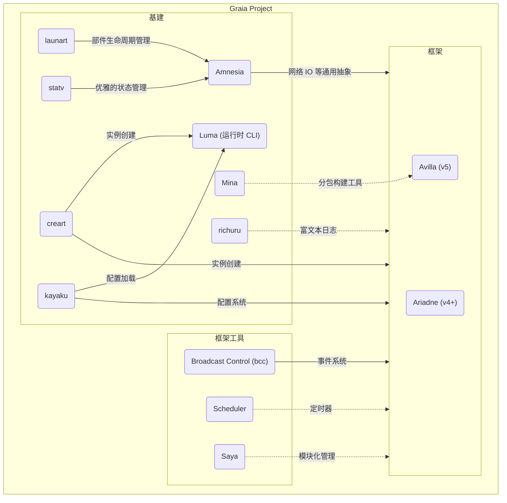
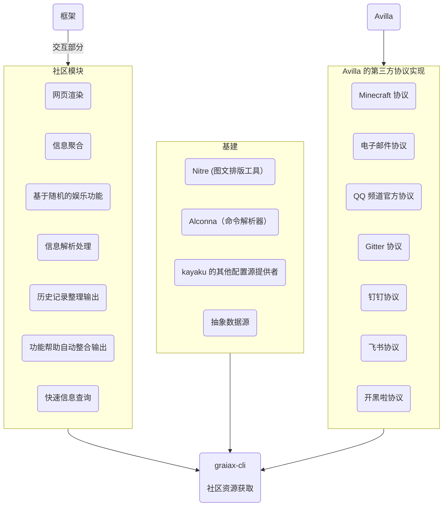

# GraiaProject 生态概览

Graia Project 是一系列的项目的集合，并最终致力于建立开放包容，具有丰富创造力的活跃 Bot 社区.

现在随着我们维护项目的不断增多，以及社区的日渐活跃，各个项目之间的关系正逐渐变得错综复杂。
我们在此处按照依赖顺序，以图表的形式列出了 Graia Project 的框架与各个库之间的关系。

```mermaid
flowchart TB
    subgraph Graia Project
        subgraph Framework [框架]
            Ariadne("Ariadne (v4+)")
            Avilla("Avilla (v5)")
        end

        subgraph FrameworkTools [框架工具]
            Broadcast("Broadcast Control (bcc)")
            Scheduler("Scheduler")
            Saya("Saya")
        end

        subgraph OfficialInfra [基建]
            launart("launart")
            statv("statv")
            Amnesia("Amnesia")
            launart -- 部件生命周期管理 --> Amnesia
            statv -- 优雅的状态管理 --> Amnesia

            Mina("Mina")
            richuru("richuru")

            creart("creart")
            Luma("Luma (运行时 CLI)")
            kayaku("kayaku")
        end


        Broadcast -- 事件系统 --> Framework
        Scheduler -. 定时器 .-> Framework
        Saya -. 模块化管理 .-> Framework

        creart -- 实例创建 --> Framework
        creart -- 实例创建 --> Luma
        kayaku -- 配置加载 --> Luma
        kayaku -- 配置系统 --> Framework

        Amnesia -- 网络 IO 等通用抽象 --> Framework
        richuru -. 富文本日志 .-> Framework
        Mina -. 分包构建工具 .-> Avilla
        
    end
```

```mermaid
flowchart TB
    Framework(框架)
    Avilla(Avilla)

        subgraph CommunityInfra [基建]
            Nitre("Nitre (图文排版工具）")
            Alconna("Alconna（命令解析器）")
            KayakuProviders("kayaku 的其他配置源提供者")
            AbstractDataSource("抽象数据源")
        end

        Framework -- 交互部分 --> CommunityModules
        subgraph CommunityModules [社区模块]
            WebRender(网页渲染)
            InfoAggregation(信息聚合)
            RandomRelated(基于随机的娱乐功能)
            Resolve(信息解析处理)
            HistoryRelated(历史记录整理输出)
            HelpGeneration(功能帮助自动整合输出)
            InlineQuery(快速信息查询)
        end

        Avilla --> AvillaThirdPartyProtocol
        subgraph AvillaThirdPartyProtocol [Avilla 的第三方协议实现]

            MInecraft(Minecraft 协议)
            Email(电子邮件协议)
            QQGuild(QQ 频道官方协议)
            Gitter(Gitter 协议)
            DingTalk(钉钉协议)
            FeiShu(飞书协议)
            KaiHeiLa(开黑啦协议)
        end


        GraiaxCLI("graiax-cli\n\n社区资源获取")
        CommunityModules --> GraiaxCLI
        CommunityInfra --> GraiaxCLI
        AvillaThirdPartyProtocol --> GraiaxCLI
```