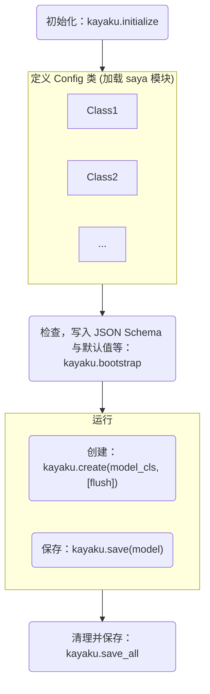

# Kayaku - 强大的配置管理解决方案

:construction: 施工中

## 安装

=== "PDM"

    ```shell
    pdm add kayaku
    ```

=== "Poetry"

    ```shell
    poetry add kayaku
    ```

## 开始

首先让我们用一段代码解释你能用 `kayaku` 做到的东西。

先写一个模块，其作用是根据用户传入的内容生成图片。

```py title="workspace/module.py"
from kayaku import config, create
from ... import command  # 假想的一个 “注册命令” 装饰器
from ... import Message  # 假想的 “消息” 容器
from ... import to_message  # 假想的从字符串转换为消息的函数
from .generator import gen_image


@config("platform.account.credential")
class PlatformCredential:
    """XX 平台的访问凭据"""

    url: str
    """平台的 API URL"""

    token: str | None = None
    """可选的 Token"""


@config("module.permission")
class ModulePerm:
    """模块的访问权限设置"""

    users: list[int]
    """允许使用本模块的用户列表"""

    groups: list[int]
    """允许使用本模块的群组列表"""


@config("module.format")
class Format:
    """设置模块的格式化相关选项"""

    command: str = ".command {content: str}"
    """设置触发的命令，需要 {content: str}"""

    format: str = "生成完毕：{content}"
    """回复时的消息链格式, 会将生成的图片传入 {content}"""

    reply: bool = True
    """是否要回复消息源"""


fmt: Format = create(Format)


@command(fmt.command)
async def generate_img(app: App, msg: Message, content: str) -> None:
    perm = create(ModulePerm, flush=True)  # 显式声明重载文件
    if not (
        (msg.source.type == "users" and msg.source.ctx not in perm.users)
        or (msg.source.type == "group" and msg.source.ctx not in perm.groups)
    ):  # 原始的权限控制
        return
    credential = create(Credential)  # 获取凭据
    img_data: bytes = await gen_image(credential.url, credential.token, content)
    return await app.send(
        target=message,
        msg=to_message(fmt.format, content=await app.to_image(img_data)),
        reply_src=fmt.reply,
    )
```

这里我们的主代码会造成不同的结果。


```py title="workspace/main.py"
import kayaku
from ... import load_module # 假想的加载模块函数

if __name__ == "__main__":
    kayaku.initialize(
        {
            "{**}": "./config/{**}"
        }
    )

    kayaku.bootstrap()

    ...

    kayaku.save_all()
```

尝试运行代码，虽然 `bootstrap()` 函数使得其报错退出，但是你应该可以看到已经生成了以下结构：

``` 
📁 workspace/
├── 🐍 main.py
├── 🐍 module.py
└── 📁 config/
    ├── 📁 module/
    │   ├── 📝 format.jsonc
    │   ├── 📄 format.schema.json
    │   ├── 📝 permission.jsonc
    │   └── 📄 permission.schema.json
    └── 📁 platform/
        └── 📁 account/
            ├── 📝 credential.jsonc
            └── 📄 credential.schema.json
```

我们先不管那几个神秘的 `.schema.json` 文件，看看 `.jsonc` 文件。

=== "config/module/format.jsonc"

    ```json
    {
        /*
        * 设置触发的命令，需要 {content: str}
        *
        * @type: str
        */
        "command": ".command {content: str}",
        /*
        * 回复时的消息链格式, 会将生成的图片传入 {content}
        *
        * @type: str
        */
        "format": "生成完毕：{content}",
        /*
        * 是否要回复消息源
        *
        * @type: bool
        */
        "reply": true,
        "$schema": "file:///[snip]/workspace/config/module/format.schema.json"
    }
    ```

=== "config/module/permission.jsonc"

    ```json hl_lines="7 13"
    {
        /*
        * 允许使用本模块的用户列表
        *
        * @type: List[int]
        */
        "users": null,
        /*
        * 允许使用本模块的群组列表
        *
        * @type: List[int]
        */
        "groups": null,
        "$schema": "file:///[snip]/workspace/config/module/permission.schema.json"
    }
    ```

=== "platform/account/credential.jsonc"

    ```json hl_lines="7"
    {
        /*
        * 平台的 API URL
        *
        * @type: str
        */
        "url": null,
        /*
        * 可选的 Token
        *
        * @type: Union[str, NoneType]
        */
        "token": null,
        "$schema": "file:///[snip]/workspace/config/platform/account/credential.schema.json"
    }
    ```

如果你使用的是较为智能的编辑器 (VS Code 或 PyCharm) 中，上面那些被高亮的行应该有错误曲线（标红等）。

这就是那些 `.schema.json` 文件的目的：通过 [`JSON Schema`](https://json-schema.org) 辅助编辑器检查，并提供补全功能。

同时，那些 dataclass field 下方的 “注释字符串” 同样也被写入文件了。

## 标注你的配置类

`Kayaku` 的很多功能依赖于 `PEP 484 类型标注`。因此，你应该保证你的类型标注是准确的，尤其是在处理 `None` 时。

例如：使用 `#!py Dict[str, Optional[Any]]` 代替 `#!py Dict[str, Any]`

如果不这样做， `Kayaku` 就无法自动转换文件内的 `None`，导致 `is None` 比对出错。

同时你不应该直接使用 `dict` `list` 之类的默认全为 `Any` 的类型作为标注。

## 流程

一般来说，你的操作流程应该长这样

