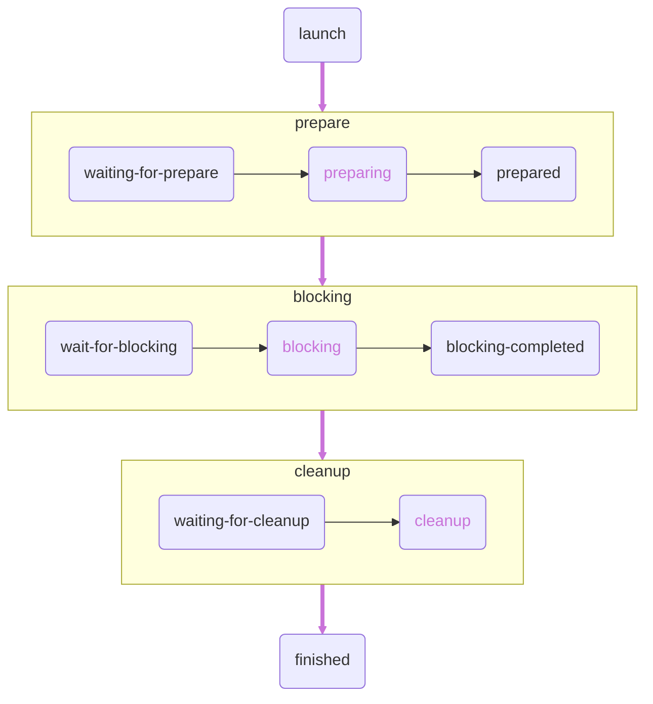
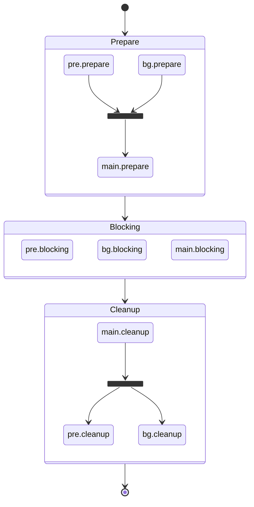

# Launart - 统一的部件生命周期管理

## Launart 可以做什么?

你是否在利用 Broadcast 的 Dispatcher 来获得一个全局/只有少量状态的，依赖于全局配置的接口？

考虑以下例子：

- `aiohttp`/`httpx` 等网络客户端的 `Session` 对象

- `uvicorn`/`fastapi`/`aiohttp` 等网络服务器的 `Server`/`Application` 实例

- `MySQL`/`redis` 等的 `Connection` 实例

这些东西都是半全局的，但是因为它们不像 [`AbstractEventLoop`][asyncio.AbstractEventLoop] 或 [`Broadcast`](./../../broadcast/basic/hello-world.md)
那样可以基本保证全局唯一, 所以不能直接托管给 [`creart`](./../creart/intro.md) 来创建和管理.

那我们要怎么处理呢？

这时我们的 `Launart` 就可以出场了.

!!! note "Tips: Launart 的命名来自于 Launch Art 的组合"

## 第一步

如果你在使用 `Ariadne`/`Avilla` 等现有的框架，那你大概已经使用上 `Launart` 了.

这种情况下你可以直接通过 `app.launch_manager` 获取实例.

```py
mgr = app.launch_manager
```

如果没有，那你直接实例化一个即可.

```py
from launart import Launart
mgr = Launart()
```

!!! tip "针对 Ariadne 用户"

    请在 **实例化 Ariadne** 后再使用 `Ariadne.launch_manager` 访问全局 `Launart` 实例。

    或者你可以用 `Ariadne.config(launch_manager=mgr)` 来预先传入.

## “可启动” 部件 - Launchable

`Launchable` 的概念有点像 "worker" 或 "background-task"，可以拿来运行全局后台任务用。

首先你需要继承 `launart.Launchable`, 然后往 `__init__` 里塞你喜欢的东西。

同时记得 `super().__init__()` 来初始化 stage 之类的东西。

### 生命周期的表现 - stage

首先你需要将 `stages` 声明为一个 [`property`][property]
（[`ClassVar`][typing.ClassVar] 也不是不行... 就是静态检查器会找你麻烦罢了）

`stages` 里要放你所 **需要** 使用到的阶段：`preparing` `blocking` `cleanup`，分别对应准备，“阻塞” 和清理阶段。

实际上生命周期所有的 “状态” 长这样：

!!! example "图表阅读说明"

    所有使用 <code style="color:#c973d9">#c973d9</code> 标记的部分（包括节点之间的边）即是你 “拥有代码控制权” 的部分。
    
    剩下的部分是由 `stage` 自动处理的。




???+ example "生命周期示例"

    ```py
    from launart import Launart, Launchable


    class Worker(Launchable):
        id = "worker"

        @property
        def stages(self):
            return {"preparing", "blocking", "cleanup"}

        @property
        def required(self):
            return set()

        async def launch(self, mgr: Launart):
            print("before prepare")

            async with self.stage("preparing"):
                print("State: preparing")

            print("after preparing")

            async with self.stage("blocking"):
                print("Start blocking!")

            print("after blocking")

            async with self.stage("cleanup"):
                print("State: cleanup")

            print("before finish")


    mgr = Launart()
    mgr.add_launchable(Worker())
    mgr.launch_blocking()
    ```

???+ note "输出（启用 richuru）"

    ```text
    INFO     Starting launart main task...
    INFO     Launching 1 components as async task...
    before prepare
    State: preparing
    after preparing
    SUCCESS  Layer #1:[worker] preparation completed.
    INFO     All components prepared, start blocking phase.
    Start blocking!
    after blocking
    INFO     Entering cleanup phase.
    State: cleanup
    before finish
    SUCCESS  component worker finished.
    INFO     [worker] completed.
    SUCCESS  Layer #1:[worker] cleanup completed.
    INFO     Cleanup completed, waiting for finalization.
    SUCCESS  All launch task finished.
    SUCCESS  Asyncio shutdown complete.
    ```

### 依赖解析

既然是 “生命周期” 管理，那肯定要管理每个部件之间的关系。

你注意到了上个部分中 `required` 属性填的是一个空的 [`set`][set] 吗？

它就是用来声明部件之间的依赖的。

只要往 `required` 中填入对应的 `Launchable.id` 即可。

假设我们有几个 `Launchable`，分别叫做 `pre` `bg` 和 `main`，`!#py main.required = {"pre", "bg"}`

那么启动流程大致是这样的：



可以看出， **准备** 部分是按照依赖顺序 **依层** 进行，**阻塞** 部分是同步进行，而 **清理** 部分是倒序 **依层** 进行的。

这可以确保你的 `Launchable` 在运行时不会因为某个部件没有启动而导致错误的结果。

### 处理退出信号

`Launart` 在准备退出（你按下 `Ctrl-C` 时）时并不会强制通过引发 [`CancelledError`][asyncio.CancelledError] 之类的异常来停止任务，
但是你的 `Launart` 实例会通过 `mgr.status.exiting` 和 `mgr.status.stage` 来标识全局状态。

当然，这仅限于需要在 `blocking` 阶段用 `while True` 之类轮询的 `Launchable`。

无论如何，下面有对应的示例。

=== "`blocking` 阶段轮询"

    ```py
    class RepeatQueryWorker(Launchable):
        id = "worker.query.repeat"

        @property
        def stages(self):
            return {"blocking"}

        @property
        def required(self):
            return set()

        async def launch(self, mgr: Launart):
            exit_mark = asyncio.create_task(mgr.status.wait_for_sigexit())
            while not exit_mark.done():
                print("Doing my awesome queries...")
                # YOUR CODE GOES HERE

                await asyncio.wait(
                    [asyncio.create_task(asyncio.sleep(3)), exit_mark],
                    return_when=asyncio.FIRST_COMPLETED, # (1)
                )
    ```

    1.  使得不管是 `sleep` 完 3 秒还是准备退出都可以立刻接收.

=== "使用单独 task 来轮询"

    ```py
    class TaskQueryWorker(Launchable):
        id = "worker.query.task"

        @property
        def stages(self):
            return {"blocking", "cleanup"}

        @property
        def required(self):
            return set()

        async def query_loop(self, mgr: Launart):
            while True:
                print("Doing my awesome queries...")
                # YOUR CODE GOES HERE
                await asyncio.sleep(3)

        async def launch(self, mgr: Launart):
            async with self.stage("blocking"):
                query_tsk = asyncio.create_task(self.query_loop(mgr))
                await mgr.status.wait_for_sigexit()
            async with self.stage("cleanup"):
                query_tsk.cancel()
                with contextlib.suppress(asyncio.CancelledError): # (1)
                    await query_tsk
    ```

    1.  这个是必要的, 否则这个 [`CancelledError`][asyncio.CancelledError] 会把 `launch` 函数崩掉.

接下来，让我们介绍真正能够实现代码复用的部分 —— [Service 和 ExportInterface](./service.md)