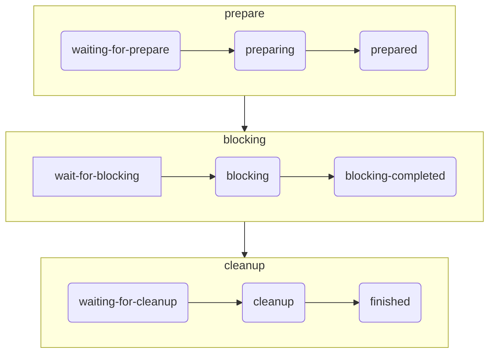

# Launart - 统一的部件生命周期管理

## Launart 可以做什么?

你是否在利用 Broadcast 的 Dispatcher 来获得一个全局/只有少量状态的，依赖于全局配置的接口？

考虑以下例子：

- `aiohttp`/`httpx` 等网络客户端的 `Session` 对象

- `uvicorn`/`fastapi`/`aiohttp` 等网络服务器的 `Server`/`Application` 实例

- `MySQL`/`redis` 等的 `Connection` 实例

这些东西都是半全局的，但是因为它们不像 [`AbstractEventLoop`][asyncio.AbstractEventLoop] 或 [`Broadcast`](./../../broadcast/basic/hello-world.md)
那样可以基本保证全局唯一, 所以不能直接托管给 [`creart`](./../creart/intro.md) 来创建和管理.

那我们要怎么处理呢？

这时我们的 `Launart` 就可以出场了.

!!! note "Tips: Launart 的命名来自于 Launch Art 的组合"

## 第一步

如果你在使用 `Ariadne`/`Avilla` 等现有的框架，那你大概已经使用上 `Launart` 了.

这种情况下你可以直接通过 `app.launch_manager` 获取实例.

```py
art = app.launch_manager
```

如果没有，那你直接实例化一个即可.

```py
from launart import Launart
art = Launart()
```

!!! tip "针对 Ariadne 用户"

    请在 **实例化 Ariadne** 后再使用 `Ariadne.launch_manager` 访问全局 `Launart` 实例。

    或者你可以用 `Ariadne.config(launch_manager=art)` 来预先传入.

## “可启动” 部件 - Launchable

`Launchable` 的概念有点像 "worker" 或 "background-task"，可以拿来运行全局后台任务用。

首先你需要继承 `launart.Launchable`, 然后往 `__init__` 里塞你喜欢的东西。

同时记得 `super().__init__()` 来初始化 stage 之类的东西。

### 生命周期的表现 - stage

首先你需要将 `stages` 声明为一个 [`property`][builtins.property]
（[`ClassVar`][typing.ClassVar] 也不是不行... 就是静态检查器会找你麻烦罢了）

`stages` 里要放你所 **需要** 使用到的阶段：`preparing` `blocking` `cleanup`，分别对应准备，“阻塞” 和清理阶段。

实际上生命周期所有的 “状态” 长这样：




!!! example "一个示例 Launchable"

    ```py
    from launart import Launchable

    class 
    ```


接下来，让我们介绍真正能够实现代码复用的部分 —— [Service 和 ExportInterface](./service.md)